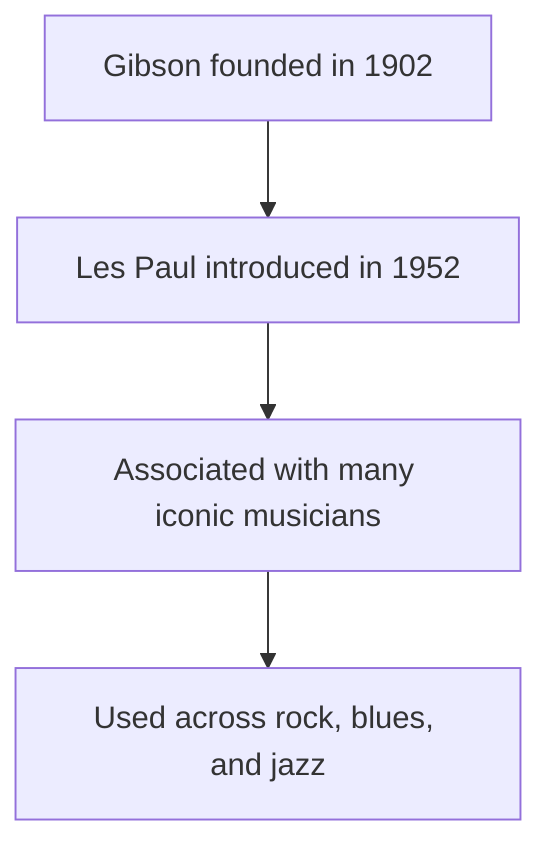

<h1 align="center"> Knes 381 HTML Assginment </h1>

<h3> February 10th 2026 </h3>
Click this link to purchase this beauty now: <a href="readme.md">Gibson for sale! </a>
<h3> Table of Contents </h3>
<ul>
<li><a href="#why-gibson">Why the Gibson</a></li>
<li><a href="#fun-facts">Fun Facts</a></li>
<li><a href="#gibson-specs">Gibson Specs</a></li>
</ul>
<h2 id="why-gibson">Why the Gibson</h2>

Gibson guitars are widely recognized for their high-quality craftsmanship and
distinct tonal characteristics. The company has a long history of producing
instruments that emphasize sustain, warmth, and depth of sound, which makes
them especially popular in genres such as rock, blues, and jazz. The use of
solid tonewoods, set-neck construction, and carefully designed pickups
contributes to the signature Gibson sound that many musicians seek.

Beyond sound quality, Gibson instruments are valued for their durability and
long-term reliability. Many Gibson guitars are designed to last decades with
proper care, often increasing in value over time. This combination of
performance, build quality, and historical significance makes Gibson guitars
appealing not only to professional musicians but also to collectors and
enthusiasts. 

<h2 id="fun-facts">Fun Facts</h2>

<h2 id="gibson-specs">Gibson Specs</h2>
<table>
<tr>
<th>Feature</th>
<th>Why it Matters</th>
</tr>
<tr>
<td>Scale length</td>
<td>Affects string tension and feel while playing.</td>
</tr>
<tr>
<td>Pickups</td>
<td>Shape tone output (brightness, warmth, clarity).</td>
</tr>
<tr>
<td>Tonewood</td>
<td>Influences resonance and sustain.</td>
</tr>
</table>

Its endurance is so good that one might say it has a high $\dot{V}O_{2,\max}$!

